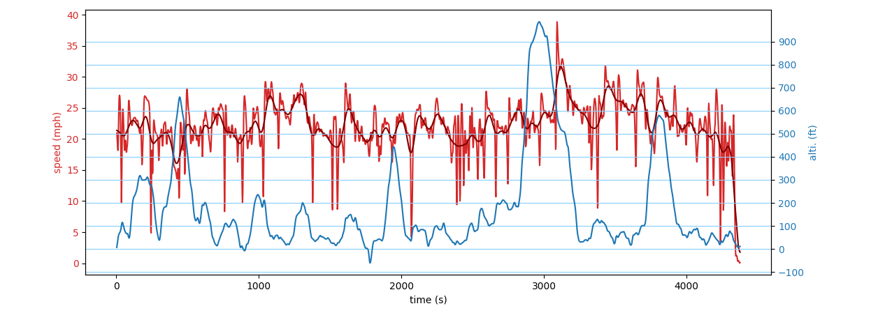
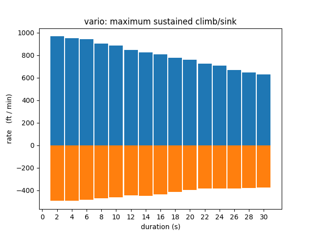

# gps_tools

Do some snazzy processing on your .igc gps logs!
Gain some insights, learn stuff, and be amazed.

# Setup

You may need to install some libs...

`sudo apt install python3` (if for some reason you don't have python3)
`sudo apt install pip3` (if you don't already have pip for python3)
`pip3 install matplot numpy`

# Usage

Check the help for arguments.

`python3 gps_tools.py -h`

Only .IGC log files are supported.

